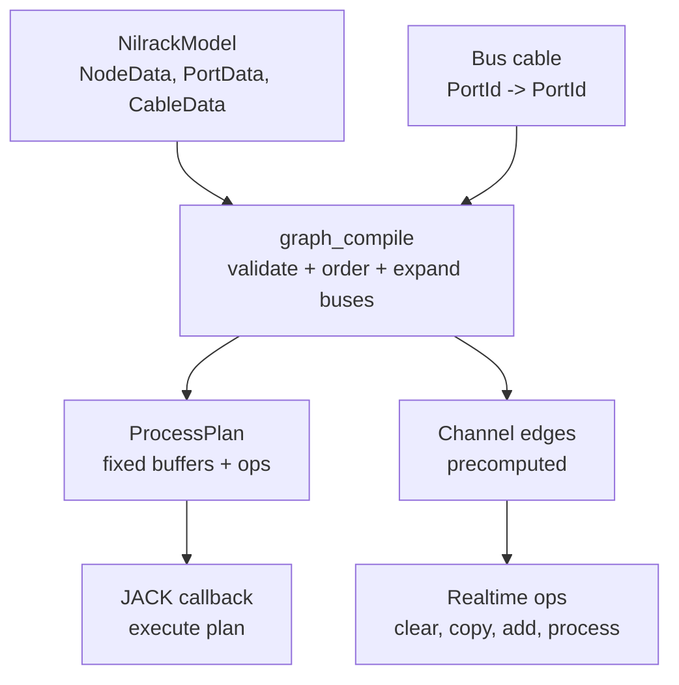

# nilrack Audio Routing

Audio routing is patchbay-first. The session model stores explicit cables
between ports. The compiler turns those cables into a fixed realtime plan.

Carla is the prior art. Its serial `RackGraph` is useful for simple plugin
chains, but its `PatchbayGraph` is the better model for nilrack. Carla records
connections as group and port pairs, then builds a render sequence before the
audio callback. nilrack keeps that division and adapts it to passive records,
typed IDs, and compiled plans.

## Routing Layers

The user and session layer talks in buses:

```text
PortData
  id
  nodeId
  kind
  direction
  channelCount

CableData
  id
  rackId
  srcPort
  dstPort
  kind
  routePolicy
  channelMapId
```

A cable connects one output `PortId` to one input `PortId`. The cable does not
store channel pointers, buffer slots, plugin handles, or process state. Those
belong to compiled audio data.

`routePolicy` and `channelMapId` are the model-owned record of user intent when
a connection needs more than the default channel policy. The compiler validates
and expands that data. It does not guess whether a stereo-to-mono cable should
drop a channel, sum channels, or pick a specific source.

The compile layer expands bus cables into channel-level routing:

```text
CableData(src stereo bus, dst stereo bus)
        |
        v
channel edge 0 -> 0
channel edge 1 -> 1
```

The realtime layer executes fixed work:

```text
clear buffers
mix cable sources into input buffers
call plugin runtime ops
copy or add outputs to downstream buffers
publish meters
```

The audio callback does not traverse `NilrackModel`, look up names, validate
cables, allocate buffers, or decide channel policy.



## Carla Prior Art

Carla exposes two useful shapes:

- `RackGraph` processes plugins in serial order and handles external input and
  output fan-in/fan-out.
- `PatchbayGraph` stores explicit node and port connections and lets
  `AudioProcessorGraph` build the process sequence.

nilrack should follow the patchbay shape. Host input and output are normal
nodes (`nkInput`, `nkOutput`), not special hidden connection lists. Serial
rack behavior is just a graph with one cable path.

Carla exposes individual channels as patchbay ports. nilrack should keep the
realtime representation channel-level, but keep the default user model
bus-level. This gives common mono and stereo plugins a quiet UI while keeping
the compiler precise.

## Channel Policy

For v1, channel mismatch rules should be conservative:

- Mono output to stereo or multichannel input duplicates the mono channel.
- Equal channel counts map one-to-one.
- Stereo or multichannel output to mono input is rejected unless the user
  chooses an explicit mapping.
- Other mismatches are rejected until advanced channel mapping exists.

These rules avoid hidden downmixes. The user should not lose channels because
a cable looked valid at a distance.

Multiple cables into one input are allowed when the port kind matches. The
compiler emits explicit sum operations. One output feeding many destinations
reuses the source buffer and emits copy or add operations as needed.

Explicit mapping policy belongs on the cable, not in transient UI state:

```text
CableRoutePolicy
  crAuto
  crChannelMap
  crSumToMono
  crDropExtra
  crSelectChannel

ChannelMapData
  id
  entries[]  # source channel -> destination channel with gain
```

The first implementation can keep only `crAuto`. When advanced mapping arrives,
session load, graph compile, and UI inspectors all read the same data.

Feedback cycles are rejected in v1. Later feedback support should be explicit,
for example through a delay node or a dedicated feedback edge type.

## Latency And Delay

Plugins may report process latency. Full plugin delay compensation is deferred,
but the model and plan should leave the hook clear:

- adapters expose reported latency as runtime metadata;
- graph compile records per-node latency in the plan or diagnostics;
- the callback does not calculate path delay while processing;
- a later plan op can implement a fixed delay line backed by plan-owned ring
  buffers.

When PDC is implemented, the compiler should calculate path latency and emit
explicit delay ops on shorter paths before mix points. Delay buffers are plan
resources. They are not allocated or resized by the callback.

## ProcessPlan Shape

`ProcessPlan` should contain the work needed by the callback:

- ordered node entries;
- plugin runtime refs;
- reported node latency and future delay buffers;
- buffer slots for host, plugin, and mix buffers;
- channel edges expanded from bus cables;
- clear, copy, add, future delay, and process operations;
- bypass and mute flags;
- meter output slots.

The compiler may allocate and sort while building the plan. The callback only
walks bounded arrays and calls plugin runtime ops.

## UI Shape

The patchbay UI should default to bus-level cables. A stereo plugin gets one
visible audio input and one visible audio output, each marked with its channel
count. The cable is one visible object, not two parallel lines.

Advanced channel mapping can live in an inspector later. It should edit mapping
policy on a bus cable, not replace the default bus cable model.

This keeps the common case fast to read and keeps the realtime layer ready for
mono, stereo, sidechain, surround, CV, and MIDI routing.
