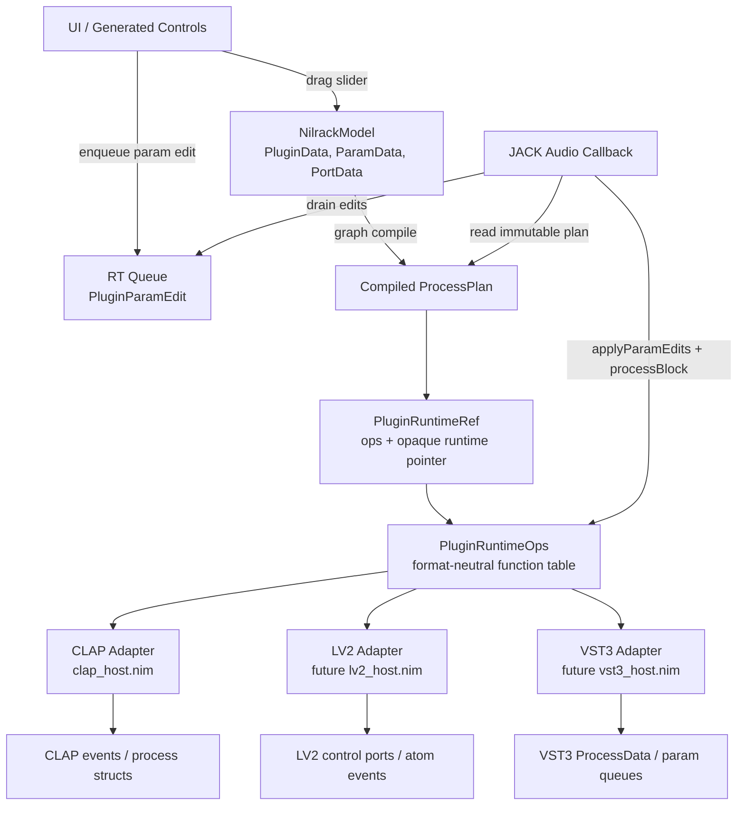

# nilrack Plugin Runtime

The plugin runtime is the boundary between nilrack's rack model and external
plugin APIs. The graph, UI, session, and audio plan use nilrack records and
IDs. CLAP, LV2, and VST3 details stay inside format adapters.

Carla proves the useful host shape: one shared plugin boundary, with each
format translating behind it. nilrack keeps that boundary, but adapts it to
the data-oriented model in [dod.md](dod.md). There is no plugin object tree.
The realtime path reads compiled records and calls function pointers.

## Runtime Boundary

`NilrackModel` owns plugin metadata, params, ports, node relationships, and
state refs. `ProcessPlan` is a callback-safe snapshot built from that model.
Loaded plugin instances sit behind opaque runtime pointers.

```text
PluginRuntimeRef
  runtime: pointer
  ops: ptr PluginRuntimeOps

PluginRuntimeOps
  activate
  deactivate
  processBlock
  applyParamEdits
  saveState
  loadState
  destroy
```

The exact Nim names can change, but the shape should not. The process plan
stores runtime refs and buffer bindings. It does not store CLAP, LV2, or VST3
event structs as shared data.

Runtime lifetime is covered by [plugin-lifecycle.md](plugin-lifecycle.md).
The model-to-plan compile contract is covered by
[graph-compile.md](graph-compile.md). The event vocabulary is covered by
[plugin-events.md](plugin-events.md).



## Parameter Edits

Generated controls emit format-neutral edits:

```text
PluginParamEdit
  pluginId
  paramId
  value
  sampleOffset
```

The UI updates `ParamData.currentVal` through normal model operations and
pushes the edit into a preallocated queue. The audio callback drains that queue
and hands edits to the runtime ops for the matching plugin.

Adapters map the generic edit to their native process input:

- CLAP writes `clap_event_param_value`.
- LV2 writes control ports or atom events.
- VST3 writes process parameter queues.

Do not introduce a shared CLAP-like event record. That would make LV2 and VST3
fit CLAP instead of fitting nilrack.

## Carla Prior Art

Carla's useful lesson is the host boundary. Its engine speaks to a common
plugin base type. CLAP, LV2, and VST3 implementations translate inside their
own subclasses. For example, a generic realtime parameter change enters
Carla's shared plugin method, while the CLAP subclass turns it into CLAP input
events before processing.

nilrack should copy that division of responsibility, not Carla's C++ object
model. In nilrack:

- shared state lives in passive records and dense tables;
- relationship truth is carried by typed IDs;
- hot audio data crosses as `ProcessPlan`;
- plugin behavior crosses through a small ops table;
- format adapters own native handles, event storage, and API calls.

## Ownership Rules

- `NilrackModel` is the source of truth for plugin metadata and session state.
- `ProcessPlan` is the audio-thread snapshot.
- Format adapters own external plugin instances and native event buffers.
- UI, graph, session, and audio scheduling code do not switch on plugin format.
- Plugin API tags select an adapter at load or scan time, not during graph
  processing.

This keeps CLAP, LV2, and VST3 dry without hiding their real differences.
